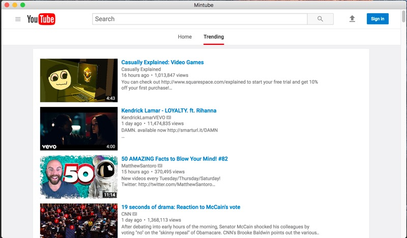
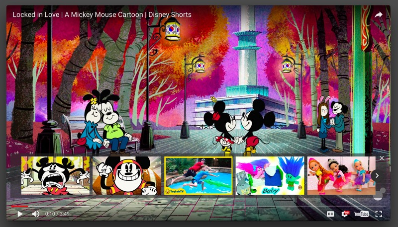
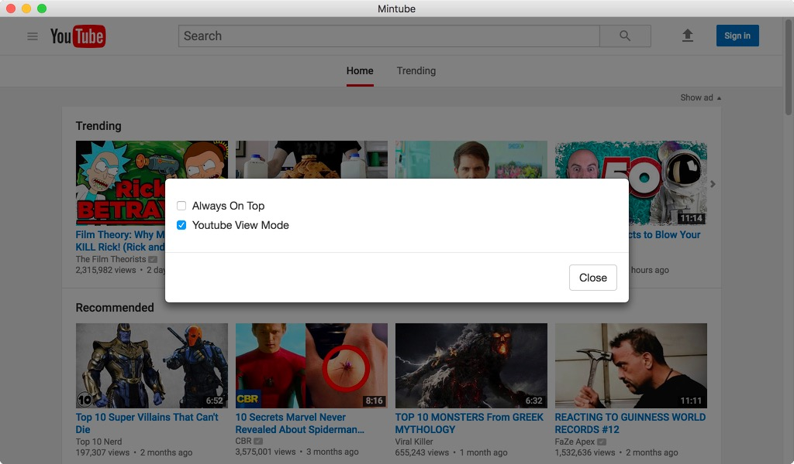

# Floatube

Floatube is a minimalistic youtube viewer that just opens youtube video in a new frameless window.

There is no navigation or whatsoever. You need to use the following keyboard shortcuts.

| Key | Description |
|--------|--------|
| Cmd + [| Go Back   |
| Cmd + ]| Go Forward |
| Cmd + o | Open option modal|
| Cmd + w | Close window|

# Downloads
[Download v0.1](https://github.com/moon0326/Floatube/releases/download/0.1/mintube.zip)

# Screenshots

#### Main Window

#### Player Window
Clicking a video thumbnail opens a new player.

#### Options 

Weekend Project: 1
